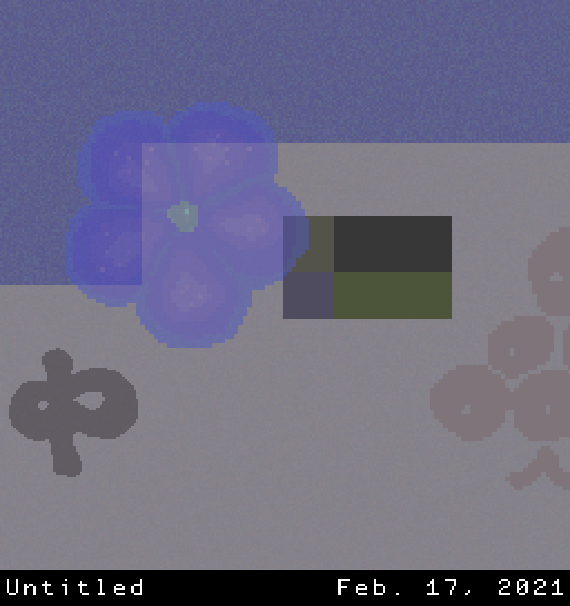
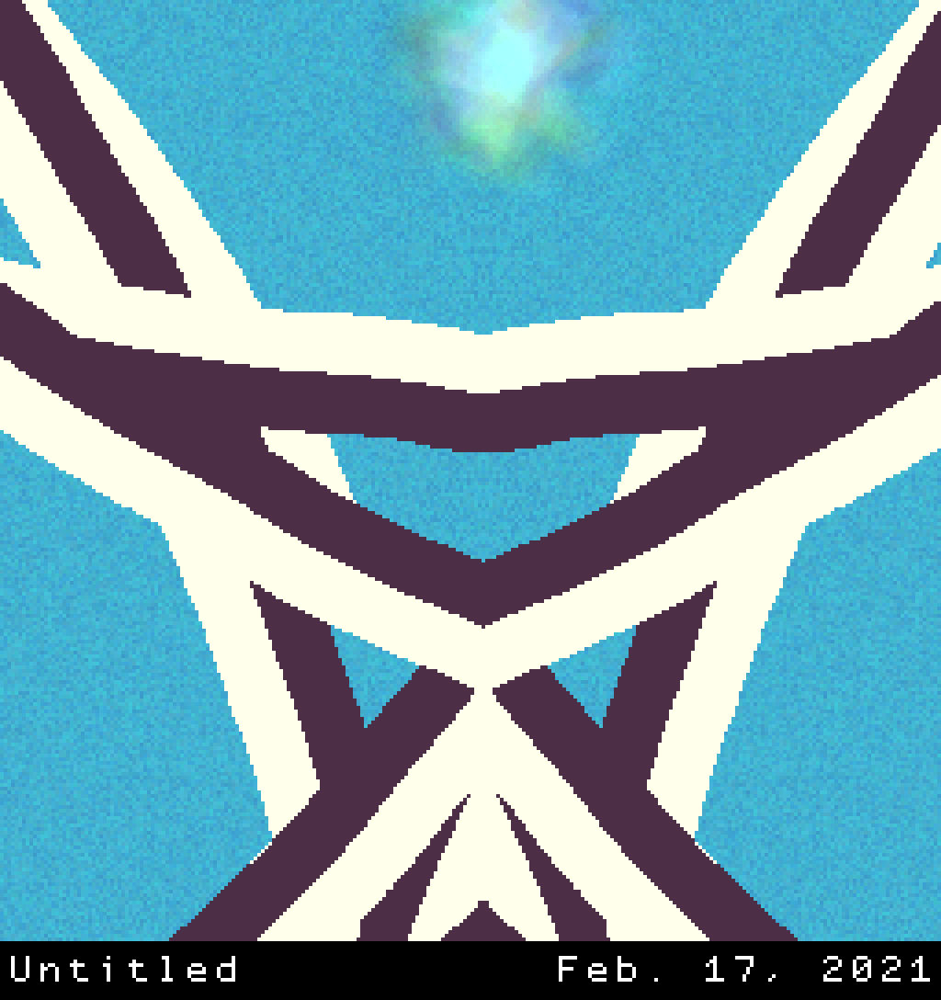
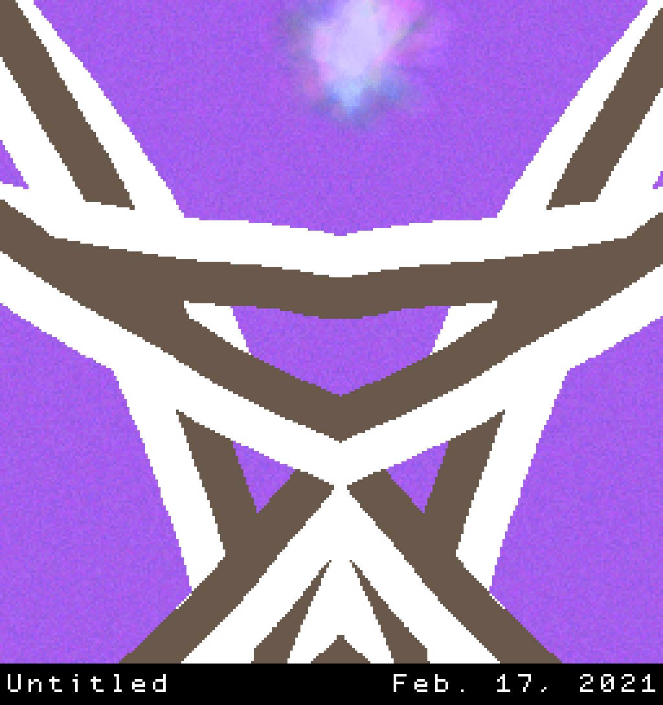

## NoPaint

I found the program to be charming to use. It was funny going in blind, pressing the buttons and observing the results, figuring out what was being displayed each time. The pixel aesthetics and sounds are fun, and although some of the elements were more fun than others, it was still interesting seeing all the different variations in terms of color, position, direction, etc.

It did frustrat me how the work you created was wholly dependent on this game of "chance." Basically waiting until the next random paint object/tool would be something you eventually liked. The lack of control definetly bothered me, but there's also something exciting about glambing on using the tools, either using it and hoping you like it or regreting using it and being incapable of taking it back, but still carrying on and hoping it would still end up looking good.

Although this is mostly in the case of trying to control the work that you make, which can be a bit stressful. I think I enjoyed my experience more when I just let the program do its thing, and just randomly selected elements to see what came up. This was especially interesting when I managed to land an appealing image, which I then slowly morphed to something I genually like. Like a mixture between random chance and controlled choice.

I think the works I made could be counted as my own. I feel like the program has so many, almost infinite outcomes, that each artwork you make is so unique and special that it would be virtually impossible for some one else to recreate it by chance. And the elements, apart from the stamps, are broad and simple enough, that any art work you make would end up looking different each time. The program, I think, is more like a big tool to create art. Like a condensed, primitive Photoshop made up entirely of pre made assets. So I think that the work that end up being made, can be counted as your know, even if the style does end up being a clear indicator that it was done in NoPaint. 

