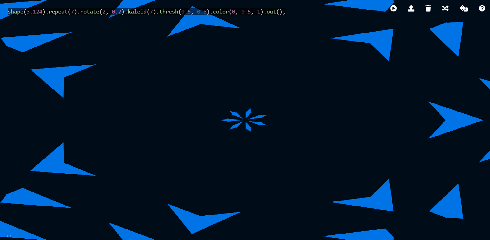
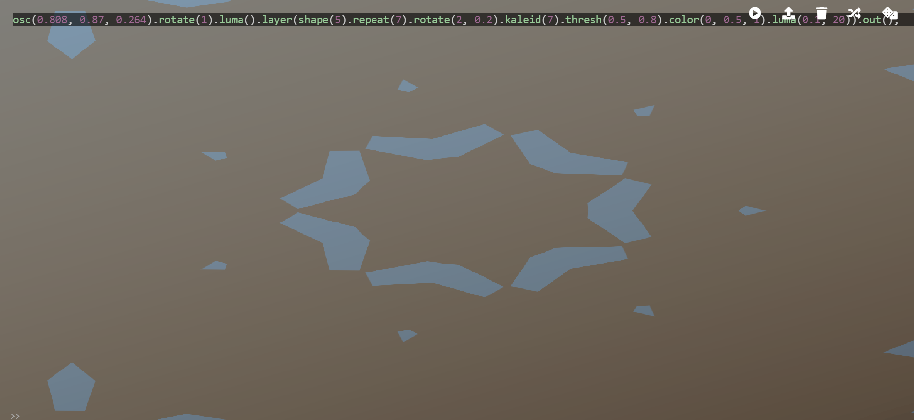
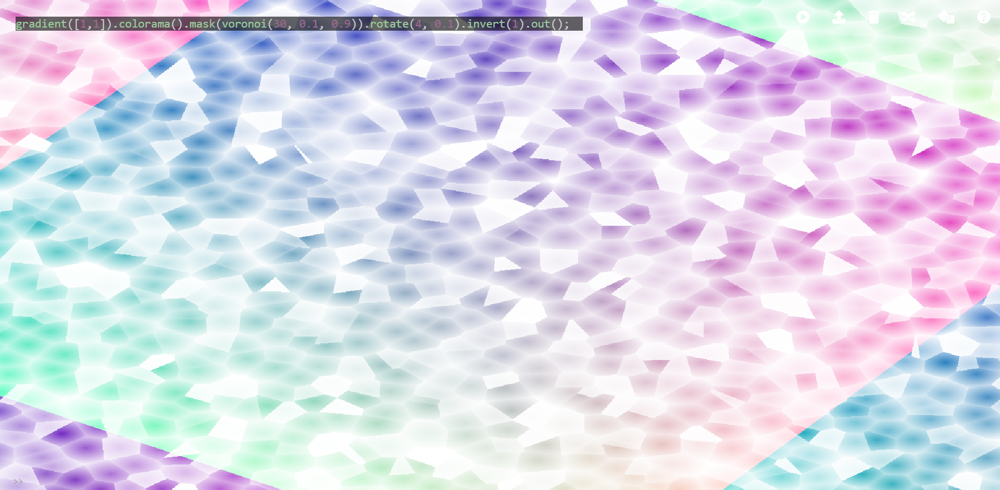
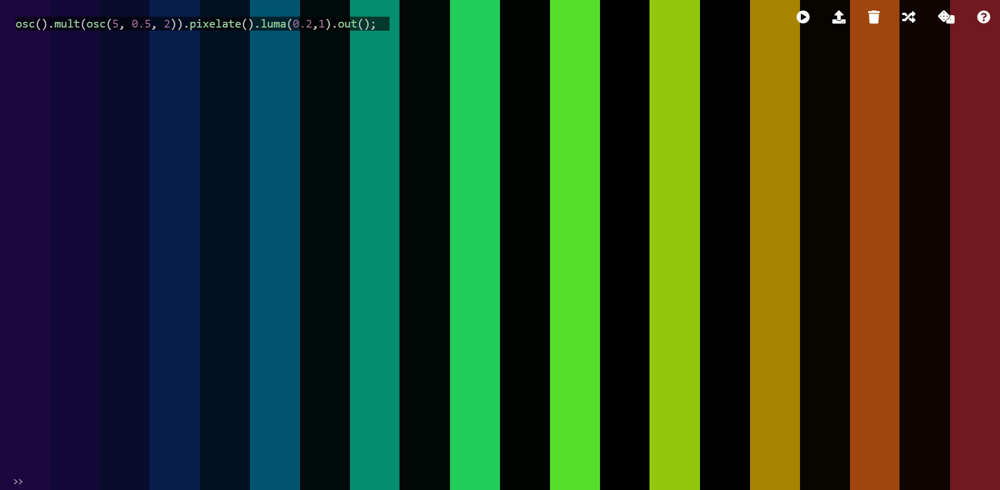
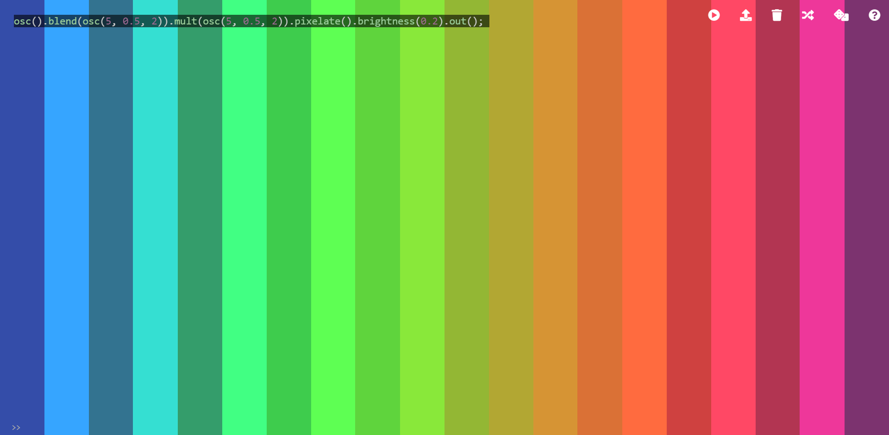

## Working with Hydra

I found my time working with Hydra to be fairly pleasant. 

I found myself surprised with how simplistic the program is, or at least looks at first. This comes in terms of the program having only a couple of options, and most of the screen being composed of the visuals.
I feel like the way it was designed makes it easy for outsiders to play with the program and experiment. And despite it being a bit odd to have all the documentation, or helpful pages, separate, I think it's emphasis on fairly simple syntax and a quick code to visuals aesthethic makes up for it.

At first, I was a bit taken aback by the lack of knowledge, such as in Tidal Cycles, but I quickly grasped the layout of the code as well as some of the simple functions. Since it's all visuals, it's easier for me to grasp what is going on, at least in terms of what functions do and how they work with one another. 

And the functions were all very different and fun to work with. My first work with Hydra reflects how I was playing around with the simple functions of kaleidoscope, shape and rotate:

Quickly after, I played around with the layer function, which I think is a great feature to be experimented with, and I got some cool deviations, such as:

Aside from that, I was also interested in the voronoi function, and I played with that a bit. I really wanted to see how I could experiment with the coloring of the voronoi function, and although I feel like it could be taken further, I kinda like what I came up with here with the use of the gradient and invert functions:

Lastly, I worked on a simplistic piece which I liked quite a lot. I really find the pixelation aethethic to be charming, so I decided to play around with the pixelate function. I'm not sure how, but after implementing the mult, luma, and blend functions, I came up with these two simple, but cute visuals:

Again, they are quite simple, and I really want to see how can I further experiment with this, especially with the blend or brightness, but overall, I found myself pretty satisfied with what I came up with.

